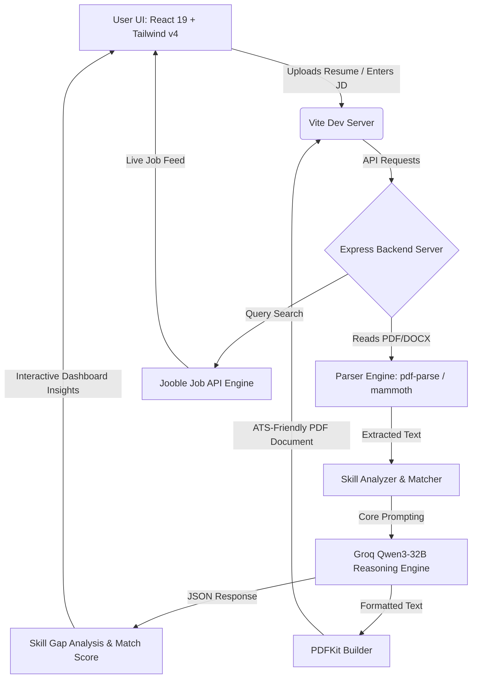

<p align="center">
  
</p>

<h1 align="center">🚀 CareerCraft AI</h1>

<p align="center">
  <strong>Supercharge your job search with a next-generation, AI-driven resume parsing, optimization, and job matching platform.</strong>
</p>

<p align="center">
  <a href="YOUR_NEW_DEPLOYED_URL"></a>
  
  
  
  
  
</p>

---

## 🌟 Overview

**CareerCraft AI** is a state-of-the-art AI-powered platform engineered to give job seekers an unfair advantage in modern applicant tracking systems (ATS). 

Instead of traditional generic resume review, CareerCraft AI acts as a digital career strategist: it uploads and parses resumes, analyzes keyword alignment against any job description, calculates realistic ATS compatibility scores, suggests tailored high-paying career profiles, and rewrites the resume into a clean, PDFkit-generated, ATS-compliant PDF—all connected with a live job feed to let users apply in one click.

---

## ✨ Features

### 🔐 Modern JWT Authentication
* **Secure Session Handling**: Fully encrypted passwords hashed via `bcrypt` with advanced JWT-based cookie storage.
* **Seamless Authentication Flow**: Login, signup, and logout integrations with route protection and API endpoint guarding.

### 📄 Intelligent Resume Parsing & SKill Extraction
* **Multi-Format Ingestion**: Supports `.pdf` and `.docx` formats.
* **Intelligent Skill Clustering**: Leverages robust parsing engines (`pdf-parse`, `mammoth`) alongside customized matching algorithms to parse and extract over 100+ specialized tech skills.

### 🤖 Groq-Powered AI Optimizer (Qwen3-32B)
* **ATS Scoring Engine**: Computes highly precise ATS match percentages based on skill mapping and semantic alignment.
* **"Why & How" Actionable Feedback**: Explains exactly why a skill is missing or sub-optimal, and provides direct copy-pasteable rewrite templates to map skills.
* **AI Career Profiler**: Analyzes existing skills to recommend 4-5 tailored high-paying job titles, explaining why they fit and what keywords to target.

### 📄 On-the-Fly ATS PDF Generator
* **Perfect Formatting**: Tailors and builds formatted, ATS-compliant resumes on-the-fly using `pdfkit`.
* **Instant Download**: Direct client-side download for customized resumes tailored perfectly to specified job descriptions.

### 🔍 Real-Time Job Search Engine
* **Jooble API Integration**: Fetches real-time, live jobs matching specified roles and skills.
* **One-Click Actions**: Offers instant job-role search via AI suggestion chips and redirects directly to application portals.

---

## 🛠️ Architecture & System Flow



---

## 📂 Directory Structure

Here is a bird's-eye view of the codebase layout:

```text
careercraft-ai/
├── backend/                  # Node.js + Express + MongoDB Server
│   ├── src/
│   │   ├── DB/               # Mongoose Connection Layer
│   │   ├── controllers/      # Route Controllers (Auth, Resume, AI, Jobs)
│   │   ├── middleware/       # Auth Guarding & Multer Uploader
│   │   ├── models/           # Mongoose Database Models (User, Resume)
│   │   ├── routes/           # REST API Endpoint Declarations
│   │   ├── services/         # Core Logic & Integration (Groq, Jooble, Parsers)
│   │   ├── utils/            # Helper Scripts
│   │   └── app.js            # Express Middlewares & Routes Hook
│   ├── uploads/              # Local File Buffer (Temporary)
│   ├── server.js             # Main server startup file
│   └── .env                  # Server environment configuration
│
├── frontend/                 # React 19 Client SPA (Vite)
│   ├── src/
│   │   ├── components/       # Custom Reusable Components & UI widgets
│   │   ├── pages/            # View Pages (Home, Features, About, Contact)
│   │   ├── AppRoutes.jsx     # Frontend Router Setup
│   │   ├── index.css         # Styling system (Tailwind v4)
│   │   ├── main.jsx          # App Entry point
│   │   └── App.jsx           # Global State & App wrapper
│   ├── vite.config.js        # Vite Build config
│   └── package.json          # Client-side configuration and plugins
│
└── careercraft_banner.png    # Brand Banner Graphic
```

---

## 🧬 Tech Stack

| Layer | Primary Technology | Purpose & Details |
|---|---|---|
| **Frontend Framework** | **React 19 (Vite)** | Superfast hot-reloading SPA client |
| **Styling Engine** | **Tailwind CSS v4** | Modern utility-first CSS featuring highly premium transitions |
| **Motion & FX** | **Framer Motion** | Silky-smooth custom micro-animations |
| **Backend API Server**| **Node.js + Express**| Custom asynchronous RESTful routing and API architecture |
| **Database** | **MongoDB (Mongoose)** | User credential records, parsed resume caching, and profile storage |
| **AI LLM Client** | **Groq SDK** | Blazing-fast inference utilizing **Qwen3-32B** reasoning models |
| **Document Parsing** | **pdf-parse / mammoth**| High-precision text extraction from PDF and Word documents |
| **Document Compiling**| **PDFKit** | Real-time vector-based generation of PDF files |
| **Job API Provider** | **Jooble API** | Aggregator fetching and serving verified, live industry listings |
| **Mailing Service** | **EmailJS** | Smooth client-side user contact form submission |

---

## 🚀 Getting Started

### 📋 Prerequisites
Make sure you have [Node.js](https://nodejs.org/) installed (v18+ recommended) and a running [MongoDB](https://www.mongodb.com/cloud/atlas) instance.

### 🔌 Environment Setup

Create a `.env` file in the **`backend/`** directory containing the following keys:

```env
PORT=3000
MONGODB_URL=mongodb+srv://<username>:<password>@cluster.mongodb.net/careercraft
JWT_SECRET=your_super_secure_jwt_secret_key

# Third-Party API keys
GROQ_API_KEY=gsk_your_groq_api_key_here
JOOBLE_API_KEY=your_jooble_api_key_here

# ImageKit Storage Credentials (Optional)
IMAGEKIT_PUBLIC_KEY=your_imagekit_public_key
IMAGEKIT_PRIVATE_KEY=your_imagekit_private_key
IMAGEKIT_URL_ENDPOINT=https://ik.imagekit.io/your_endpoint_id
```

---

### 💻 Running the App Locally

#### 1. Launch the Backend Server
```bash
# Navigate to backend directory
cd backend

# Install dependencies
npm install

# Run backend in development mode (with nodemon auto-reload)
npm run dev
# Server will launch at: http://localhost:3000
```

#### 2. Launch the Frontend Client
```bash
# Navigate to frontend directory
cd frontend

# Install dependencies
npm install

# Start Vite server
npm run dev
# App will launch at: http://localhost:5173
```

---

## 📡 API Reference

### 🔐 Authentication (`/api/auth`)
* `POST /api/auth/register` - Create a brand new user profile
* `POST /api/auth/login` - Authenticate credentials and receive token cookie
* `POST /api/auth/logout` - Clear active user sessions

### 📄 Resume Operations (`/api/resume`)
* `POST /api/resume/upload` - Securely upload and parse a `.pdf` or `.docx` document
* `GET /api/resume/my-resumes` - Retrieve parsed skills, profile parameters, and past uploads

### 🤖 AI Actions (`/api/ai`)
* `POST /api/ai/optimize` - Compare parsed skills with a Job Description, return matching & missing parameters and recommendations
* `POST /api/ai/suggest-jobs` - Analyze skills to suggest dynamic matching job tracks
* `POST /api/ai/generate-pdf` - Programmatically build and download a fully optimized ATS-compliant PDF resume

### 🔍 Live Job Searches (`/api/jobs`)
* `POST /api/jobs/search` - Search active global databases via Jooble's live feed

---

## 🤝 Contributing

Contributions are what make the open source community such an amazing place to learn, inspire, and create. Any contributions you make are **greatly appreciated**.

1. Fork the Project
2. Create your Feature Branch (`git checkout -b feature/AmazingFeature`)
3. Commit your Changes (`git commit -m 'Add some AmazingFeature'`)
4. Push to the Branch (`git push origin feature/AmazingFeature`)
5. Open a Pull Request

---

<p align="center">
  Built with ❤️ by the CareerCraft AI Team.
</p>
